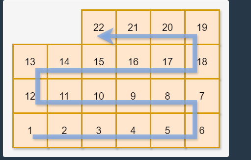

1. 택배상자꺼내기 =>

    a. 문제에 주어진대로 2차원 배열에 숫자 입력, num일경우 해당 num의 좌표 기억(xIdx, yIdx)
    b. 배열[가장 꼭대기행, yIdx]의 값이 있을경우 -> 총 층의 수 - num이 위치한 층
    c. 배열[가장 꼭대기행, yIdx]의 값이 없을경우에는 추가로 -1 -> 총 층의 수 - num이 위치한 층 -1 

2. 숫자짝꿍
    a. X로들어오는 숫자 갯수 기록, Y로 들어오는 숫자 갯수 기록
    b. 9부텨 0까지 X와 Y에 공통으로 들어있는숫자 기록
    c. 비어있을경우 -1, 0만 있을경우 0만출력 , 이외엔 기록된 숫자 출력력